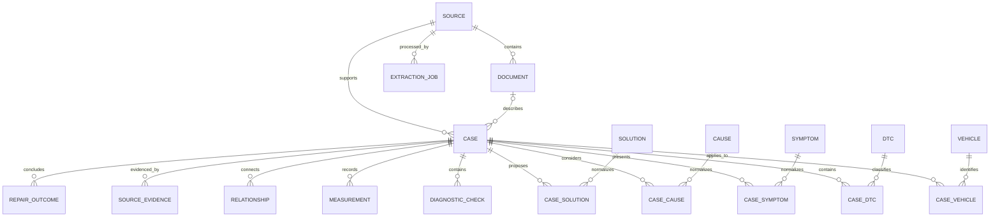

# Data model

## Principles

1. The relational model represents the domain, not the current response shape of an LLM.
2. Raw and validated outputs are preserved in JSONB for auditing and re-extraction.
3. Normalized entities also retain case-specific wording in association tables.
4. Relationships, their origin, and their confidence level are first-class data.
5. Probabilities stated by a source are separate from probabilities calculated later.
6. Machine validation gates relational persistence; human review does not.
7. Every stored case carries an explicit review status that future retrieval can use as a quality signal.

## Main relationships



## Ingestion tables

### `sources`

| Column              | Indicative type      | Notes                                                                      |
| ------------------- | -------------------- | -------------------------------------------------------------------------- |
| `id`                | UUID                 | Primary key.                                                               |
| `type`              | enum                 | `pdf`, `email`, `whatsapp`, `text`, `audio`, `diagnostic_report`, `other`. |
| `status`            | enum                 | Overall progress state.                                                    |
| `original_filename` | text nullable        | Filename submitted by the user.                                            |
| `mime_type`         | text nullable        | Detected or validated type.                                                |
| `storage_path`      | text nullable        | Private Storage path.                                                      |
| `raw_text`          | text nullable        | Complete text when useful; pages remain structured separately.             |
| `author`            | text nullable        | Only when known.                                                           |
| `source_date`       | timestamptz nullable | Date belonging to the content.                                             |
| `created_at`        | timestamptz          | Ingestion date.                                                            |
| `updated_at`        | timestamptz          | Last modification.                                                         |

### `documents`

| Column          | Indicative type  | Notes                                       |
| --------------- | ---------------- | ------------------------------------------- |
| `id`            | UUID             | Primary key.                                |
| `source_id`     | UUID FK          | Parent source.                              |
| `title`         | text nullable    | Explicit, extracted, or human-edited title. |
| `language`      | text nullable    | Language code when known.                   |
| `page_count`    | integer nullable | Number of pages.                            |
| `pages_json`    | JSONB nullable   | `{ page, text }` array for the MVP.         |
| `metadata_json` | JSONB nullable   | Non-domain metadata.                        |
| `created_at`    | timestamptz      | Creation date.                              |
| `content_hash`  | nullable         | SHA-256 of file to avoid duplications       |

`pages_json` provides a simple starting point. A `document_pages` table may replace it if search requirements or volume justify the change.

`documents.language` describes the source content language. It is independent from the frontend locale. English or Italian UI selection must never alter extracted evidence or source-language metadata.

### `extraction_jobs`

| Column             | Indicative type      | Notes                                                          |
| ------------------ | -------------------- | -------------------------------------------------------------- |
| `id`               | UUID                 | Primary key.                                                   |
| `source_id`        | UUID FK              | Processed source.                                              |
| `status`           | enum                 | `pending`, `running`, `completed`, `schema_invalid`, `failed`. |
| `model`            | text nullable        | Model actually used.                                           |
| `prompt_version`   | text nullable        | Reproducible prompt version.                                   |
| `started_at`       | timestamptz nullable | Start time.                                                    |
| `finished_at`      | timestamptz nullable | End time.                                                      |
| `error`            | text nullable        | Actionable message without secrets.                            |
| `raw_ai_output`    | JSONB nullable       | Immutable raw model output.                                    |
| `validated_output` | JSONB nullable       | Output conforming to the Zod contract.                         |
| `created_at`       | timestamptz          | Creation date.                                                 |

## Domain tables

### `cases`

| Column                | Indicative type      | Notes                                              |
| --------------------- | -------------------- | -------------------------------------------------- |
| `id`                  | UUID                 | Primary key.                                       |
| `source_id`           | UUID FK              | Supporting source.                                 |
| `document_id`         | UUID FK nullable     | Optional logical document.                         |
| `extraction_job_id`   | UUID FK nullable     | Job that proposed this version.                    |
| `case_type`           | text nullable        | Category when explicitly known.                    |
| `title`               | text nullable        | Human-readable title.                              |
| `complaint`           | text nullable        | Customer complaint or initial observation.         |
| `problem_description` | text nullable        | Technical description.                             |
| `analysis_summary`    | text nullable        | Summary clearly identified as analysis.            |
| `status`              | enum                 | Lifecycle state: `active`, `rejected`, `archived`. |
| `review_status`       | enum                 | `unreviewed`, `reviewed`, `corrected`.             |
| `created_at`          | timestamptz          | Creation date.                                     |
| `updated_at`          | timestamptz          | Modification date.                                 |
| `reviewed_at`         | timestamptz nullable | Most recent human review date.                     |
| `review_notes`        | text nullable        | Optional administrative notes.                     |

Newly normalized cases are inserted with `status = active` and `review_status = unreviewed`. Human review is never required for insertion. Rejecting or archiving a case removes it from normal retrieval without deleting its source or extraction history.

### `vehicles` and `case_vehicles`

`vehicles` contains `brand`, `model`, `generation`, `year_from`, `year_to`, `engine_description`, `engine_code`, `fuel_type`, `power`, and `transmission`. Unknown fields remain `null`.

`case_vehicles` links several vehicles to a case and may contain `relation_origin`, `confidence`, and a compatibility note.

### DTCs

- `dtcs`: `id`, `code`, `normalized_code`, `description`.
- `case_dtcs`: `id`, `case_id`, `dtc_id`, `is_primary`, `relationship_type`, `relation_origin`, `confidence`.

Recommended constraints:

- unique `dtcs.normalized_code`;
- no more than one `case_dtcs.is_primary = true` per case;
- `confidence` between 0 and 1 when present;
- `relationship_type` among `primary`, `possible_cause`, `consequence`, `associated_fault`, `alternative_fault`, `same_system`, `secondary_code`, and `unclear`.

### Symptoms, causes, and solutions

- `symptoms(id, normalized_name)` and `case_symptoms(id, case_id, symptom_id, description, relation_origin, confidence)`.
- `causes(id, normalized_name)` and `case_causes(id, case_id, cause_id, description, probability_source, probability_calculated, relation_origin, confidence)`.
- `solutions(id, normalized_name)` and `case_solutions(id, case_id, solution_id, description, probability_source, probability_calculated, repair_confirmed, repair_successful, relation_origin, confidence)`.

Normalized names support search and future statistics. The association description preserves the source document's wording.

### Components

- `components(id, name, normalized_name, component_type)`.
- `case_components(id, case_id, component_id, role, relation_origin, confidence)`.

### Checks and measurements

- `diagnostic_checks(id, case_id, description, expected_result, actual_result, interpretation, sequence_order, relation_origin, confidence)`.
- `measurements(id, case_id, diagnostic_check_id, parameter, value_text, numeric_value, unit, conditions, min_value, max_value, relation_origin, confidence)`.

`value_text` preserves the value as written. `numeric_value` is populated only when conversion is safe.

### Procedures, parts, and outcomes

- `repair_procedures(id, case_id, case_solution_id nullable, sequence_order, instruction, relation_origin, confidence)`.
- `parts_materials(id, case_id, name, part_number, manufacturer, notes, relation_origin, confidence)`.
- `repair_outcomes(id, case_id, case_solution_id nullable, attempted, successful, confirmed, case_count, successful_case_count, notes)`.

Do not confuse `successful` with `confirmed`: a source may report success without providing enough evidence to classify the result as confirmed.

## Evidence and graph

### `source_evidence`

| Column            | Purpose                                              |
| ----------------- | ---------------------------------------------------- |
| `source_id`       | Original source.                                     |
| `case_id`         | Related case.                                        |
| `entity_type`     | Type of targeted entity.                             |
| `entity_id`       | Target identifier, nullable for general evidence.    |
| `page_number`     | Page when available.                                 |
| `excerpt`         | Short passage supporting the information.            |
| `evidence_type`   | Evidence level.                                      |
| `relation_origin` | `explicit_source`, `ai_inference`, or `human_added`. |
| `confidence`      | Confidence, mainly useful for inferences.            |

Initial `evidence_type` values: `theoretical_possible_solution`, `manufacturer_documentation`, `technical_bulletin`, `workshop_report`, `real_case`, `confirmed_repair`, `multiple_confirmed_cases`, and `unclear`.

### `relationships`

This table connects two nodes in the same case:

```text
DTC → cause
cause → symptom
cause → diagnostic check
diagnostic check → confirms/refutes cause
cause → solution
solution → repair outcome
DTC → related DTC
```

Columns: `id`, `case_id`, `from_type`, `from_id`, `relationship_type`, `to_type`, `to_id`, `relation_origin`, `confidence`, and `source_evidence_id`.

Traditional foreign keys cannot fully guarantee polymorphic references. The persistence service must therefore verify that both nodes exist and belong to the same case.

## Probabilities

### `probability_source`

Set this value only when the source explicitly provides a probability or frequency. Preserve the original wording in evidence to avoid losing the distinction between a percentage, a qualitative frequency, and a number of cases.

### `probability_calculated`

Always `null` in the MVP. It will be calculated later from verifiable aggregates, never while extracting a single document.

### `probability_stats`

Future table, not implemented in the MVP. It may aggregate vehicle context, engine, simultaneous DTCs, symptoms, tests, causes, solutions, and confirmed outcomes.

## Recommended indexes

- `sources(status, created_at desc)`;
- `extraction_jobs(source_id, created_at desc)`;
- `cases(status, review_status, created_at desc)`;
- unique `dtcs(normalized_code)`;
- `vehicles(brand, model, engine_code)`;
- indexes on every foreign key in association tables;
- add full-text search only after real query patterns are known.

## Implemented database baseline

The Phase 1 schema is defined in `prisma/schema.prisma` and maps camel-case Prisma fields to snake-case PostgreSQL identifiers. It includes the ingestion, normalized knowledge, evidence, and graph tables required by the documented PDF pipeline and later retrieval phases. It does not implement `probability_stats`, embeddings, chat storage, or retrieval logic.

The initial SQL migration adds database features that are not fully represented by the Prisma schema:

- confidence values are constrained to the inclusive range from 0 to 1;
- `probability_calculated` is constrained to remain `null` during the MVP;
- only one primary DTC may exist per case, and the `is_primary` flag must agree with the DTC relationship type;
- page counts, page numbers, sequence positions, year ranges, measurement ranges, and outcome counts are checked for consistency;
- SHA-256 document hashes must be lowercase 64-character hexadecimal values when present;
- row-level security is enabled on every application table, with no browser-facing policies in this phase.

Check constraints are kept in the migration SQL because Prisma ORM does not currently express PostgreSQL `CHECK` constraints in the Prisma Schema Language. Any future migration must preserve these constraints explicitly.

## Admin edits and traceability

The raw and validated AI outputs are immutable audit artifacts. Editing a normalized case changes domain records, not those extraction artifacts. At minimum, the case stores `updated_at`, `review_status`, `reviewed_at`, and optional `review_notes`. When authentication is introduced, edits should also record the responsible actor and a revision history.

Future conversational retrieval must filter out rejected and archived cases. Review status is used for ranking and disclosure, not as an absolute requirement for retrieval.
